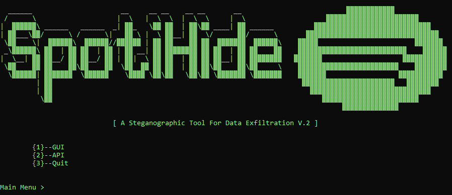

# SpotiHide2

<p align="center">
<b>A steganographic tool for data exfiltration</b>
</p>

<p align="center">

</p>

## Installation
```console
# Clone the repo
$ git clone https://github.com/kh4r0nt3/SpotiHide2.git

# Change the working directory to SpotiHide2
$ cd SpotiHide2

# Install the requirements
$ pip install -r requirements.txt
```

## Quick Start

To get started, create a (free) developer account https://developer.spotify.com/dashboard/. Once logged in, create a new Application, you can use http://localhost:8080/callback for redirect URI. Get your Client ID and retrieve your Client Secret. Open lib/spotihideapi.py and edit the enviromental variables:

```bash
self.__username = ''
self.__client_id = ''
self.__client_secret = '' 
self.__redirect_uri = 'http://localhost:8080/callback'
```

## Usage
```bash
Main Menu > 1

Spotify > help
```

```console
[*] Usage GUI:  show local
                add PLAYLIST
```

```bash
Main Menu > 2

Spotify > help
```

```console
[*] Usage API:
                show artists
                show tracks
                show all

                update artists ENTROPY BITS
                update tracks ENTROPY

                encode filename PATH PLAYLIST THRESHOLD
                encode PLAYLIST MESSAGE

                decode local [USERNAME] PLAYLIST THRESHOLD
                decode [USERNAME] PLAYLIST THRESHOLD
```
